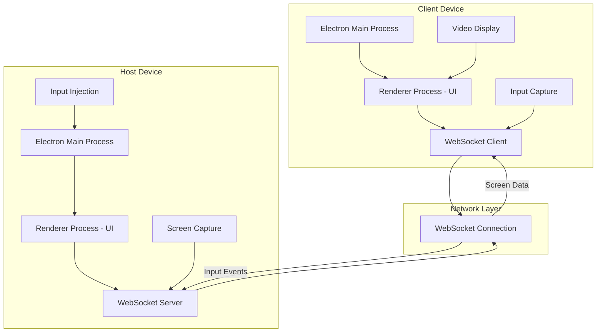

# Design Document: Remote Desktop Control

## Overview

The remote desktop control application is built using Electron.js as the desktop framework, Node.js for the backend logic, and WebSocket technology for real-time communication. The system consists of two main components: a Host application that shares its screen and accepts input commands, and a Client application that displays the remote screen and sends input events.

The architecture follows a peer-to-peer model where one device acts as the host (controlled device) and another as the client (controlling device). Communication occurs through WebSocket connections with binary data streaming for screen capture and JSON messaging for input events and control commands.

## Architecture



The system uses a layered architecture:
- **Presentation Layer**: Electron renderer processes handling UI
- **Application Layer**: Main processes managing core logic
- **Communication Layer**: WebSocket connections for data transfer
- **System Layer**: Native APIs for screen capture and input control

## Components and Interfaces

### Screen Capture Service
**Purpose**: Captures the host device's screen content in real-time
**Technology**: Electron's `desktopCapturer` API combined with HTML5 Canvas for frame processing
**Interface**:
```typescript
interface ScreenCaptureService {
  startCapture(displayId: string, frameRate: number): Promise<void>
  stopCapture(): void
  onFrameReady(callback: (frameData: Buffer) => void): void
  getAvailableDisplays(): Promise<Display[]>
}
```

The service uses Electron's desktopCapturer to access screen sources, captures frames using MediaRecorder or Canvas API, compresses frames using built-in browser compression, and streams binary data through WebSocket connections.

### Input Control Service
**Purpose**: Handles mouse and keyboard input injection on the host device
**Technology**: RobotJS library for cross-platform input simulation
**Interface**:
```typescript
interface InputControlService {
  moveMouse(x: number, y: number): void
  clickMouse(button: 'left' | 'right' | 'middle'): void
  scrollMouse(direction: 'up' | 'down', clicks: number): void
  pressKey(key: string, modifiers?: string[]): void
  typeString(text: string): void
}
```

RobotJS provides native bindings for Windows, macOS, and Linux, handles coordinate translation between client and host screen resolutions, processes keyboard events including special keys and modifiers, and manages mouse events with proper button mapping.

### Connection Manager
**Purpose**: Manages WebSocket connections between client and host
**Technology**: Node.js WebSocket library (ws) integrated with Electron
**Interface**:
```typescript
interface ConnectionManager {
  startServer(port: number, accessCode: string): Promise<void>
  connectToHost(address: string, accessCode: string): Promise<void>
  disconnect(): void
  onConnectionEstablished(callback: () => void): void
  onConnectionLost(callback: () => void): void
  sendData(data: Buffer | object): void
  onDataReceived(callback: (data: any) => void): void
}
```

The manager handles WebSocket server creation on the host side, client connection establishment with authentication, automatic reconnection logic with exponential backoff, and binary data transmission for screen frames with JSON messaging for control events.

### Authentication Service
**Purpose**: Provides secure access control and session management
**Technology**: Built-in Node.js crypto module for token generation and validation
**Interface**:
```typescript
interface AuthenticationService {
  generateAccessCode(): string
  validateAccessCode(code: string): boolean
  createSession(clientId: string): string
  validateSession(token: string): boolean
  encryptData(data: Buffer): Buffer
  decryptData(encryptedData: Buffer): Buffer
}
```

The service generates random access codes for connection authorization, creates unique session tokens for active connections, implements basic encryption for data transmission, and manages session lifecycle and timeout handling.

## Data Models

### Connection Session
```typescript
interface ConnectionSession {
  sessionId: string
  clientId: string
  hostId: string
  accessCode: string
  isActive: boolean
  startTime: Date
  lastActivity: Date
  encryptionKey: string
}
```

### Screen Frame
```typescript
interface ScreenFrame {
  frameId: number
  timestamp: number
  width: number
  height: number
  format: 'jpeg' | 'png' | 'webp'
  data: Buffer
  isKeyFrame: boolean
}
```

### Input Event
```typescript
interface InputEvent {
  type: 'mouse' | 'keyboard' | 'scroll'
  timestamp: number
  data: MouseEvent | KeyboardEvent | ScrollEvent
}

interface MouseEvent {
  x: number
  y: number
  button?: 'left' | 'right' | 'middle'
  action: 'move' | 'click' | 'release'
}

interface KeyboardEvent {
  key: string
  modifiers: string[]
  action: 'press' | 'release'
}

interface ScrollEvent {
  x: number
  y: number
  deltaX: number
  deltaY: number
}
```

### Display Information
```typescript
interface Display {
  id: string
  name: string
  width: number
  height: number
  scaleFactor: number
  isPrimary: boolean
}
```

## Correctness Properties

*A property is a characteristic or behavior that should hold true across all valid executions of a system-essentially, a formal statement about what the system should do. Properties serve as the bridge between human-readable specifications and machine-verifiable correctness guarantees.*

### Property 1: Screen Capture Frame Rate
*For any* active control session, the screen capture system should maintain a frame rate of at least 15 FPS when capturing the host desktop.
**Validates: Requirements 1.1**

### Property 2: Screen Transmission Latency
*For any* screen content change on the host device, the updated frame should be transmitted to the client within 100ms.
**Validates: Requirements 1.2**

### Property 3: Multi-Monitor Detection
*For any* host system with multiple displays, the screen capture system should detect and make available all connected displays for client selection.
**Validates: Requirements 1.3**

### Property 4: Dynamic Resolution Adaptation
*For any* host screen resolution change during an active session, the system should automatically adjust capture parameters and notify the client of the change.
**Validates: Requirements 1.4**

### Property 5: Video Compression Efficiency
*For any* captured screen frame, the compressed data size should be significantly smaller than the uncompressed size while maintaining acceptable visual quality.
**Validates: Requirements 1.5**

### Property 6: Mouse Coordinate Translation
*For any* mouse movement event sent from the client, the host cursor should move to the corresponding translated coordinates on the host screen.
**Validates: Requirements 2.1**

### Property 7: Mouse Click Relay
*For any* mouse click event performed on the client, the corresponding click action should be executed at the correct location on the host device.
**Validates: Requirements 2.2**

### Property 8: Keyboard Input Relay
*For any* keyboard input including special keys typed on the client, the same characters and key combinations should appear on the host device.
**Validates: Requirements 2.3**

### Property 9: Modifier Key Preservation
*For any* keyboard shortcut using modifier keys (Ctrl, Alt, Shift) on the client, the exact modifier combination should be preserved and executed on the host.
**Validates: Requirements 2.4**

### Property 10: Scroll Event Transmission
*For any* scroll action performed on the client, the corresponding scroll event should occur at the correct location on the host device.
**Validates: Requirements 2.5**

### Property 11: WebSocket Connection Establishment
*For any* valid connection request from a client with correct credentials, a WebSocket connection should be successfully established with the host.
**Validates: Requirements 3.1**

### Property 12: Automatic Reconnection Attempts
*For any* connection loss during an active session, the system should attempt exactly 3 reconnection attempts before giving up.
**Validates: Requirements 3.2**

### Property 13: Connection Exclusivity
*For any* host with an active client connection, additional connection attempts should be rejected until the current session ends.
**Validates: Requirements 3.3**

### Property 14: Graceful Connection Termination
*For any* application closure on either client or host side, the WebSocket connection should be properly terminated and resources cleaned up.
**Validates: Requirements 3.4**

### Property 15: Connection Heartbeat Maintenance
*For any* active connection, heartbeat messages should be sent at regular intervals to detect network connectivity issues.
**Validates: Requirements 3.5**

### Property 16: Access Code Authentication
*For any* connection attempt, the system should require and validate a unique access code before allowing session establishment.
**Validates: Requirements 4.1**

### Property 17: Authentication Failure Handling
*For any* connection attempt with invalid credentials, the system should reject the connection and log the failed attempt.
**Validates: Requirements 4.2**

### Property 18: Data Encryption During Session
*For any* active session, all data transmitted between client and host should be encrypted to prevent unauthorized access.
**Validates: Requirements 4.3**

### Property 19: Unique Session Token Generation
*For any* established connection, the system should generate a unique session token that differs from all other active or previous sessions.
**Validates: Requirements 4.4**

### Property 20: Suspicious Activity Response
*For any* detected suspicious activity during a session, the system should immediately terminate the connection and log the security event.
**Validates: Requirements 4.5**

### Property 21: Platform-Specific API Usage
*For any* operating system (Windows, macOS, Linux), the screen capture system should use the most appropriate platform-specific APIs for optimal performance.
**Validates: Requirements 5.2**

### Property 22: Cross-Platform Input Translation
*For any* input event sent between different operating systems, the event should be correctly translated to work properly on the target platform.
**Validates: Requirements 5.3**

### Property 23: Operating System Detection
*For any* host device, the system should correctly detect the operating system and adjust functionality accordingly.
**Validates: Requirements 5.4**

### Property 24: Platform Path Handling
*For any* file path used by the application, the system should handle platform-specific path formats correctly across different operating systems.
**Validates: Requirements 5.5**

### Property 25: Network Latency Performance
*For any* screen data transmission on a local network, the end-to-end latency should remain under 200ms.
**Validates: Requirements 6.1**

### Property 26: Adaptive Quality Control
*For any* network bandwidth limitation, the system should automatically reduce video quality to maintain responsiveness.
**Validates: Requirements 6.2**

### Property 27: CPU Usage Optimization
*For any* situation where CPU usage exceeds 80%, the system should reduce capture frame rate to prevent system slowdown.
**Validates: Requirements 6.3**

### Property 28: Hardware Acceleration Utilization
*For any* system with available hardware acceleration, the screen capture and encoding should utilize hardware acceleration for improved performance.
**Validates: Requirements 6.4**

### Property 29: Idle Resource Optimization
*For any* idle period during an active session, the system should reduce resource usage while maintaining the connection.
**Validates: Requirements 6.5**

### Property 30: Network Error Messaging
*For any* network error that occurs, the system should display clear error messages with suggested solutions to the user.
**Validates: Requirements 8.1**

### Property 31: Screen Capture Recovery
*For any* screen capture failure, the system should attempt to reinitialize the capture process and notify the user of the status.
**Validates: Requirements 8.2**

### Property 32: Input Error Resilience
*For any* input injection failure, the system should log the error and continue processing other input events without interruption.
**Validates: Requirements 8.3**

### Property 33: Crash Recovery State Management
*For any* application crash, the system should save the current session state and offer recovery options when restarted.
**Validates: Requirements 8.4**

### Property 34: Permission Guidance System
*For any* situation with insufficient system permissions, the system should guide users through the process of granting necessary access.
**Validates: Requirements 8.5**

## Error Handling

The system implements comprehensive error handling across all components:

### Network Error Handling
- Connection timeouts with exponential backoff retry logic
- WebSocket error detection and automatic reconnection attempts
- Bandwidth adaptation when network quality degrades
- Clear user messaging for network-related issues

### Screen Capture Error Handling
- Fallback mechanisms when primary capture methods fail
- Automatic display detection refresh when monitors change
- Graceful degradation when hardware acceleration is unavailable
- Memory management to prevent capture buffer overflow

### Input System Error Handling
- Input event queuing to handle temporary injection failures
- Coordinate validation to prevent out-of-bounds mouse movements
- Keyboard layout detection and adaptation for different systems
- Error logging without disrupting the user experience

### Authentication Error Handling
- Secure handling of invalid access codes
- Session timeout management with user notification
- Encryption key rotation on security events
- Audit logging for all authentication attempts

## Testing Strategy

The testing approach combines unit testing for specific functionality with property-based testing for comprehensive validation across all possible inputs and scenarios.

### Unit Testing Approach
Unit tests focus on specific examples and edge cases:
- Individual component functionality (screen capture, input injection, connection management)
- Platform-specific behavior verification
- Error condition handling and recovery mechanisms
- User interface interaction testing
- Integration points between system components

### Property-Based Testing Configuration
Property-based tests validate universal properties using **fast-check** library for JavaScript/TypeScript:
- Minimum 100 iterations per property test to ensure comprehensive coverage
- Each property test references its corresponding design document property
- Tag format: **Feature: remote-desktop-control, Property {number}: {property_text}**
- Randomized input generation for screen resolutions, input events, and network conditions
- Automated verification of correctness properties across all generated test cases

### Testing Framework Integration
- **Jest** for unit testing framework with Electron testing utilities
- **fast-check** for property-based testing implementation
- **Spectron** for end-to-end Electron application testing
- **Mock WebSocket servers** for connection testing without network dependencies
- **Virtual display drivers** for screen capture testing in CI environments

### Continuous Integration Testing
- Automated testing across Windows, macOS, and Linux platforms
- Performance benchmarking to ensure latency and frame rate requirements
- Security testing for authentication and encryption mechanisms
- Memory leak detection during extended session testing
- Network simulation testing for various bandwidth and latency conditions